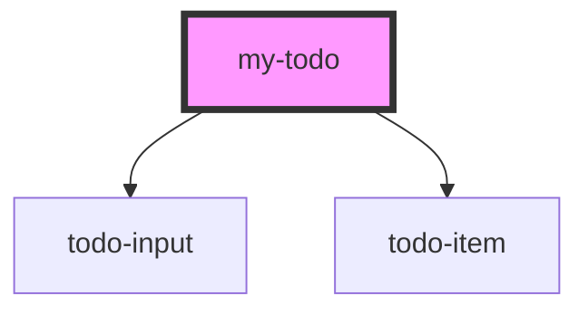

# my-todo

<!-- Auto Generated Below -->

## Dependencies

### Depends on

- [todo-input](../todo-input)
- [todo-item](../todo-item)

### Graph

----------------------------------------------

*Built with [StencilJS](https://stenciljs.com/)*
