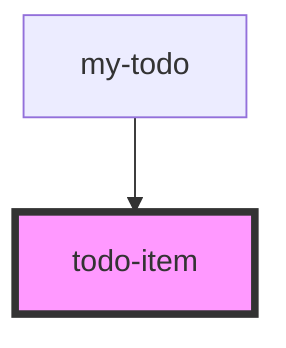

# todo-item

<!-- Auto Generated Below -->

## Properties

| Property  | Attribute | Description | Type      | Default     |
| --------- | --------- | ----------- | --------- | ----------- |
| `checked` | `checked` |             | `boolean` | `undefined` |
| `index`   | `index`   |             | `number`  | `undefined` |
| `text`    | `text`    |             | `string`  | `undefined` |

## Events

| Event               | Description | Type               |
| ------------------- | ----------- | ------------------ |
| `onTodoItemChecked` |             | `CustomEvent<any>` |
| `onTodoItemRemove`  |             | `CustomEvent<any>` |

## Dependencies

### Used by

 - [my-todo](../my-todo)

### Graph

----------------------------------------------

*Built with [StencilJS](https://stenciljs.com/)*
